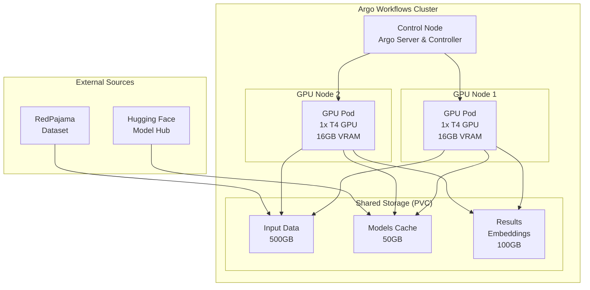
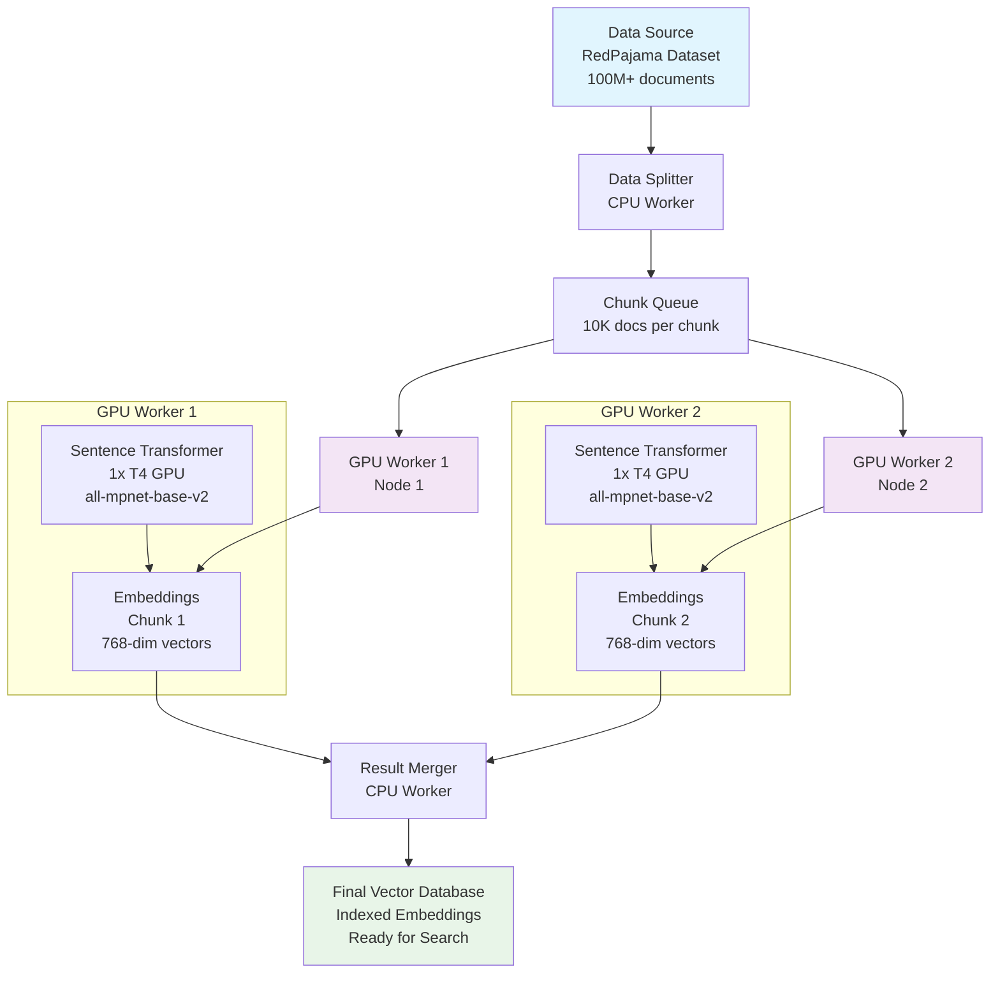
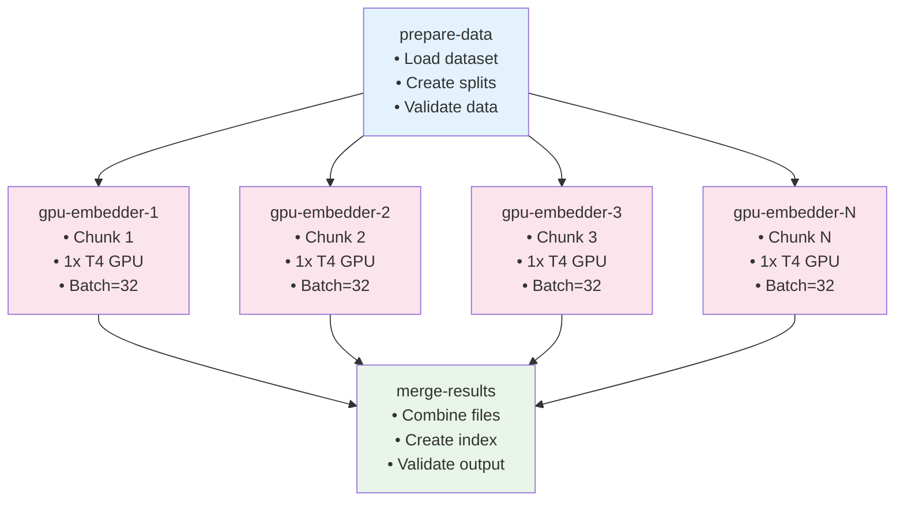
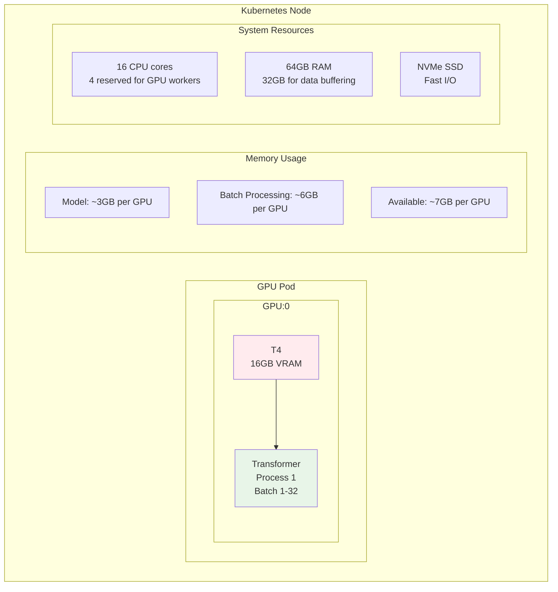
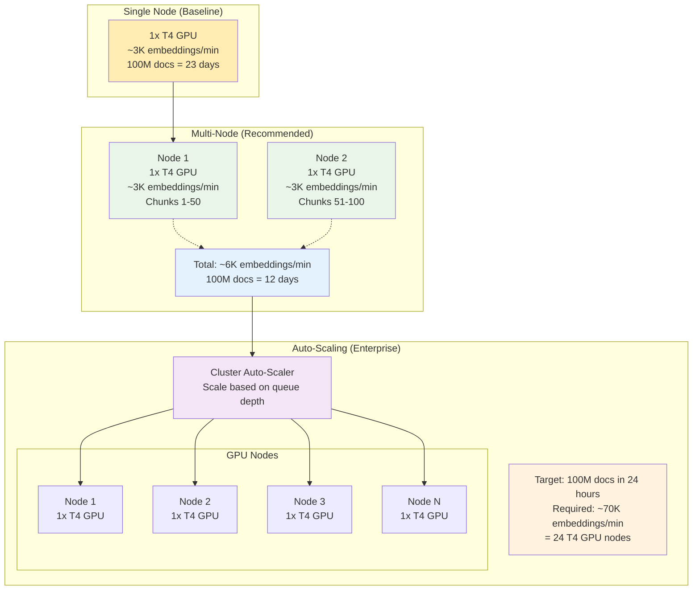

# Architecture Diagrams: GPU Workload on Argo Workflows

## System Overview



## Data Flow Architecture



## Argo Workflow DAG Structure



## GPU Resource Allocation



## Data Processing Pipeline

```mermaid
flowchart TD
    subgraph "Input"
        DS[RedPajama Dataset<br/>100M+ documents]
    end

    subgraph "Step 1: Data Chunking"
        DC1[Load streaming dataset]
        DC2[Split into 10K document chunks]
        DC3[Serialize chunks to storage]
        DC1 --> DC2 --> DC3
    end

    subgraph "Step 2: Parallel GPU Processing"
        W1[Worker 1<br/>Chunks 1-25<br/>GPU Node 1]
        W2[Worker 2<br/>Chunks 26-50<br/>GPU Node 1]
        W3[Worker 3<br/>Chunks 51-75<br/>GPU Node 2]
        W4[Worker 4<br/>Chunks 76-100<br/>GPU Node 2]
    end

    subgraph "Step 3: Embedding Generation"
        EG1[Model Loading]
        EG2[Batch Processing<br/>32 docs per batch]
        EG3[GPU Memory Management]
        EG4[Output: 768-dim embeddings]
        EG1 --> EG2 --> EG3 --> EG4
    end

    subgraph "Step 4: Result Aggregation"
        RA1[Collect embedding files]
        RA2[Create unified index]
        RA3[Validate completeness]
        RA4[Vector database format]
        RA1 --> RA2 --> RA3 --> RA4
    end

    subgraph "Performance Metrics"
        PM1[Throughput: ~3K embeddings/min per T4]
        PM2[Total: 100M docs in ~23 days (single T4)]
        PM3[GPU Utilization: 80-90%]
        PM4[Cost: ~$0.0003 per 1K embeddings]
    end

    DS --> DC1
    DC3 --> W1
    DC3 --> W2
    DC3 --> W3
    DC3 --> W4

    W1 --> EG1
    W2 --> EG1
    W3 --> EG1
    W4 --> EG1

    EG4 --> RA1

    style DS fill:#e1f5fe
    style W1 fill:#f3e5f5
    style W2 fill:#f3e5f5
    style W3 fill:#f3e5f5
    style W4 fill:#f3e5f5
    style RA4 fill:#e8f5e8
```

## Scaling Patterns



These Mermaid diagrams provide cleaner, more professional visualizations of the GPU workload architecture that will render properly in any markdown-compatible environment.

These diagrams illustrate the key architectural patterns for implementing GPU workloads on Argo Workflows, showing data flow, resource allocation, and scaling strategies for production deployments.
